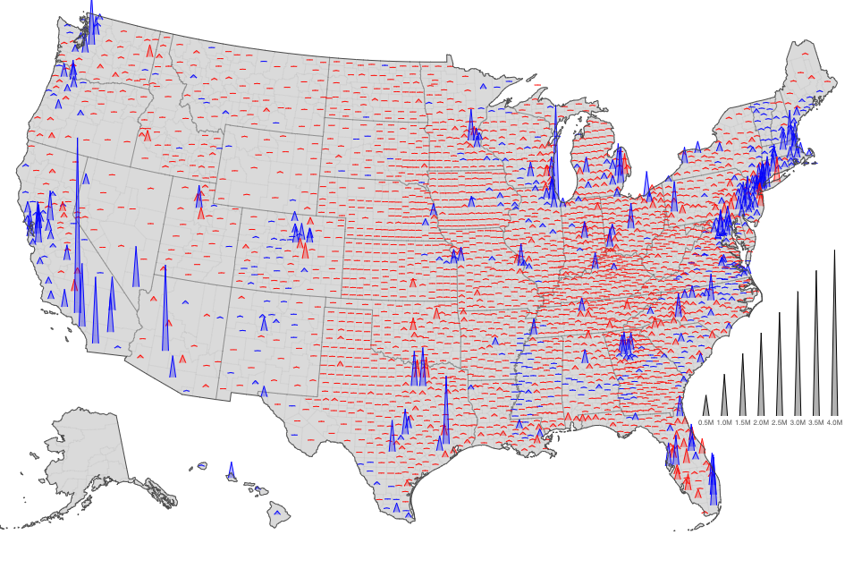

# Visualizing Results for US Elections 2020

* Rich county-level data visualized for a better overview of
* Interactive visualizations (zoom, hover, state level magnification)
* Usage data source with latest voting results (auto-updates)

**See Live:** https://election-results-2020.netlify.app/

Charting Tool: D3JS, Observable HQ  
Data Source: https://github.com/tonmcg/US_County_Level_Election_Results_08-20     
(Data for Alaska unavailable due to inconsistencies with 'fips id')

